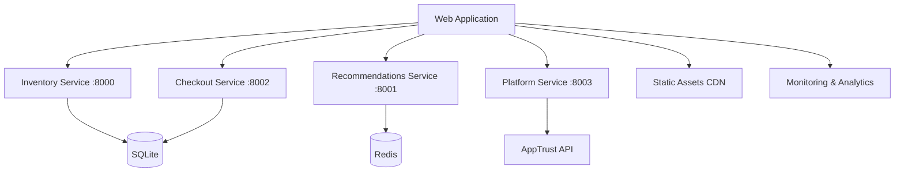

# BookVerse Web Application - API Integration Guide

**Complete service consumption patterns, error handling, and authentication flow for BookVerse microservices integration**

The BookVerse Web Application integrates with multiple backend microservices through sophisticated HTTP clients, implementing robust error handling, authentication flow, and resilient communication patterns for enterprise-grade API consumption.

---

## 📋 Table of Contents

- [Service Architecture Overview](#-service-architecture-overview)
- [HTTP Client Foundation](#-http-client-foundation)
- [Authentication Flow](#-authentication-flow)
- [Service Integration Patterns](#-service-integration-patterns)
- [Error Handling Strategy](#-error-handling-strategy)
- [Resilience Patterns](#-resilience-patterns)
- [Performance Optimization](#-performance-optimization)
- [Monitoring & Observability](#-monitoring--observability)
- [Testing API Integration](#-testing-api-integration)
- [Troubleshooting Guide](#-troubleshooting-guide)

---

## 🏗️ Service Architecture Overview

### BookVerse Microservices Ecosystem

The Web Application integrates with the following microservices:



### Service Responsibilities

| Service | Purpose | Primary Endpoints | Integration Pattern |
|---------|---------|-------------------|-------------------|
| **Inventory** | Product catalog and stock management | `/books`, `/books/{id}`, `/inventory/{id}` | Real-time queries |
| **Recommendations** | AI-powered book suggestions | `/recommendations`, `/recommendations/trending` | Background processing |
| **Checkout** | Order processing and payments | `/orders`, `/orders/{id}`, `/checkout` | Transactional operations |
| **Platform** | Release management and aggregation | `/version`, `/health`, `/metrics` | System monitoring |

### API Communication Principles

- **Async/Await Pattern**: All API calls use modern async/await syntax
- **Fetch API**: Native Fetch API with AbortController for timeout management
- **JSON Communication**: Standardized JSON request/response format
- **RESTful Design**: Standard HTTP methods and status codes
- **Error Consistency**: Unified error response format across services

---

## 🌐 HTTP Client Foundation

### Base HTTP Client Implementation

```javascript
// src/services/http.js
class HttpClient {
  constructor(baseUrl, options = {}) {
    this.baseUrl = baseUrl.endsWith('/') ? baseUrl.slice(0, -1) : baseUrl;
    this.defaultHeaders = {
      'Content-Type': 'application/json',
      'Accept': 'application/json',
      ...options.headers
    };
    this.timeout = options.timeout || 30000; // 30 second default
    this.retryAttempts = options.retryAttempts || 3;
  }

  async request(endpoint, options = {}) {
    const url = `${this.baseUrl}${endpoint}`;
    const controller = new AbortController();
    
    // Set timeout
    const timeoutId = setTimeout(() => controller.abort(), this.timeout);
    
    const config = {
      headers: { ...this.defaultHeaders, ...options.headers },
      signal: controller.signal,
      ...options
    };

    try {
      const response = await fetch(url, config);
      clearTimeout(timeoutId);
      
      if (!response.ok) {
        throw new HttpError(response.status, response.statusText, await response.text());
      }
      
      return await response.json();
    } catch (error) {
      clearTimeout(timeoutId);
      
      if (error.name === 'AbortError') {
        throw new TimeoutError('Request timeout');
      }
      
      throw error;
    }
  }

  async get(endpoint, params = {}) {
    const queryString = new URLSearchParams(params).toString();
    const url = queryString ? `${endpoint}?${queryString}` : endpoint;
    return this.request(url, { method: 'GET' });
  }

  async post(endpoint, data) {
    return this.request(endpoint, {
      method: 'POST',
      body: JSON.stringify(data)
    });
  }

  async put(endpoint, data) {
    return this.request(endpoint, {
      method: 'PUT',
      body: JSON.stringify(data)
    });
  }

  async delete(endpoint) {
    return this.request(endpoint, { method: 'DELETE' });
  }
}
```

### Service-Specific Client Configuration

```javascript
// Service client configuration
const serviceClients = {
  inventory: new HttpClient(CONFIG.INVENTORY_API_URL, {
    timeout: 10000,
    retryAttempts: 3,
    headers: { 'Service-Name': 'bookverse-web' }
  }),
  
  recommendations: new HttpClient(CONFIG.RECOMMENDATIONS_API_URL, {
    timeout: 15000,
    retryAttempts: 2,
    headers: { 'Service-Name': 'bookverse-web' }
  }),
  
  checkout: new HttpClient(CONFIG.CHECKOUT_API_URL, {
    timeout: 30000,
    retryAttempts: 1,
    headers: { 'Service-Name': 'bookverse-web' }
  }),
  
  platform: new HttpClient(CONFIG.PLATFORM_API_URL, {
    timeout: 5000,
    retryAttempts: 3,
    headers: { 'Service-Name': 'bookverse-web' }
  })
};
```

---

## 🔐 Authentication Flow

### OIDC Authentication Implementation

```javascript
// src/services/auth.js
class AuthService {
  constructor() {
    this.token = localStorage.getItem('bookverse_token');
    this.refreshToken = localStorage.getItem('bookverse_refresh_token');
    this.tokenExpiry = localStorage.getItem('bookverse_token_expiry');
  }

  async authenticate(credentials) {
    try {
      const response = await serviceClients.platform.post('/auth/login', credentials);
      
      this.token = response.access_token;
      this.refreshToken = response.refresh_token;
      this.tokenExpiry = Date.now() + (response.expires_in * 1000);
      
      // Persist tokens securely
      localStorage.setItem('bookverse_token', this.token);
      localStorage.setItem('bookverse_refresh_token', this.refreshToken);
      localStorage.setItem('bookverse_token_expiry', this.tokenExpiry);
      
      // Set up automatic token refresh
      this.scheduleTokenRefresh();
      
      return response.user;
    } catch (error) {
      console.error('Authentication failed:', error);
      throw new AuthError('Authentication failed', error);
    }
  }

  async refreshAccessToken() {
    if (!this.refreshToken) {
      throw new AuthError('No refresh token available');
    }

    try {
      const response = await serviceClients.platform.post('/auth/refresh', {
        refresh_token: this.refreshToken
      });
      
      this.token = response.access_token;
      this.tokenExpiry = Date.now() + (response.expires_in * 1000);
      
      localStorage.setItem('bookverse_token', this.token);
      localStorage.setItem('bookverse_token_expiry', this.tokenExpiry);
      
      this.scheduleTokenRefresh();
      
      return this.token;
    } catch (error) {
      console.error('Token refresh failed:', error);
      this.logout();
      throw new AuthError('Token refresh failed', error);
    }
  }

  scheduleTokenRefresh() {
    // Refresh token 5 minutes before expiry
    const refreshTime = this.tokenExpiry - Date.now() - (5 * 60 * 1000);
    
    if (refreshTime > 0) {
      setTimeout(() => {
        this.refreshAccessToken().catch(console.error);
      }, refreshTime);
    }
  }

  getAuthHeaders() {
    if (this.isTokenExpired()) {
      throw new AuthError('Token expired');
    }
    
    return {
      'Authorization': `Bearer ${this.token}`
    };
  }

  isAuthenticated() {
    return this.token && !this.isTokenExpired();
  }

  isTokenExpired() {
    return Date.now() >= this.tokenExpiry;
  }

  logout() {
    this.token = null;
    this.refreshToken = null;
    this.tokenExpiry = null;
    
    localStorage.removeItem('bookverse_token');
    localStorage.removeItem('bookverse_refresh_token');
    localStorage.removeItem('bookverse_token_expiry');
  }
}
```

### Request Interceptor for Authentication

```javascript
// Extend HttpClient with authentication
class AuthenticatedHttpClient extends HttpClient {
  constructor(baseUrl, options = {}) {
    super(baseUrl, options);
    this.authService = new AuthService();
  }

  async request(endpoint, options = {}) {
    // Add authentication headers if user is authenticated
    if (this.authService.isAuthenticated()) {
      options.headers = {
        ...options.headers,
        ...this.authService.getAuthHeaders()
      };
    }

    try {
      return await super.request(endpoint, options);
    } catch (error) {
      // Handle authentication errors
      if (error.status === 401) {
        try {
          await this.authService.refreshAccessToken();
          
          // Retry with new token
          options.headers = {
            ...options.headers,
            ...this.authService.getAuthHeaders()
          };
          
          return await super.request(endpoint, options);
        } catch (refreshError) {
          // Redirect to login if refresh fails
          window.location.href = '/login';
          throw new AuthError('Authentication required');
        }
      }
      
      throw error;
    }
  }
}
```

---

## 🔌 Service Integration Patterns

### Inventory Service Integration

```javascript
// src/services/inventory.js
class InventoryService {
  constructor() {
    this.client = serviceClients.inventory;
    this.cache = new Map();
    this.cacheTimeout = 5 * 60 * 1000; // 5 minutes
  }

  async getBooks(filters = {}) {
    const cacheKey = `books_${JSON.stringify(filters)}`;
    const cached = this.cache.get(cacheKey);
    
    if (cached && Date.now() - cached.timestamp < this.cacheTimeout) {
      return cached.data;
    }

    try {
      const response = await this.client.get('/books', filters);
      
      // Cache successful response
      this.cache.set(cacheKey, {
        data: response.books,
        timestamp: Date.now()
      });
      
      return response.books;
    } catch (error) {
      console.error('Failed to fetch books:', error);
      
      // Return cached data if available during error
      if (cached) {
        console.warn('Using stale cache data due to API error');
        return cached.data;
      }
      
      throw error;
    }
  }

  async getBook(bookId) {
    const cacheKey = `book_${bookId}`;
    const cached = this.cache.get(cacheKey);
    
    if (cached && Date.now() - cached.timestamp < this.cacheTimeout) {
      return cached.data;
    }

    try {
      const book = await this.client.get(`/books/${bookId}`);
      
      this.cache.set(cacheKey, {
        data: book,
        timestamp: Date.now()
      });
      
      return book;
    } catch (error) {
      if (error.status === 404) {
        return null; // Book not found
      }
      
      console.error(`Failed to fetch book ${bookId}:`, error);
      throw error;
    }
  }

  async checkInventory(bookId) {
    try {
      const inventory = await this.client.get(`/inventory/${bookId}`);
      return {
        available: inventory.quantity_available > 0,
        quantity: inventory.quantity_available,
        lastUpdated: inventory.last_updated
      };
    } catch (error) {
      console.error(`Failed to check inventory for ${bookId}:`, error);
      return { available: false, quantity: 0 };
    }
  }

  // Real-time inventory updates
  subscribeToInventoryUpdates(bookId, callback) {
    const pollInterval = 30000; // 30 seconds
    
    const poll = async () => {
      try {
        const inventory = await this.checkInventory(bookId);
        callback(inventory);
      } catch (error) {
        console.error('Inventory polling error:', error);
      }
    };
    
    const intervalId = setInterval(poll, pollInterval);
    
    // Return cleanup function
    return () => clearInterval(intervalId);
  }
}
```

### Recommendations Service Integration

```javascript
// src/services/recommendations.js
class RecommendationsService {
  constructor() {
    this.client = serviceClients.recommendations;
    this.cache = new Map();
  }

  async getRecommendations(userId, context = {}) {
    const cacheKey = `recommendations_${userId}_${JSON.stringify(context)}`;
    const cached = this.cache.get(cacheKey);
    
    // Recommendations cache for 10 minutes
    if (cached && Date.now() - cached.timestamp < 10 * 60 * 1000) {
      return cached.data;
    }

    try {
      const recommendations = await this.client.post('/recommendations', {
        user_id: userId,
        context: context,
        limit: context.limit || 10
      });
      
      this.cache.set(cacheKey, {
        data: recommendations,
        timestamp: Date.now()
      });
      
      return recommendations;
    } catch (error) {
      console.error('Failed to fetch recommendations:', error);
      
      // Fallback to trending books
      return this.getTrendingBooks();
    }
  }

  async getTrendingBooks(limit = 10) {
    try {
      const trending = await this.client.get('/recommendations/trending', { limit });
      return trending.books || [];
    } catch (error) {
      console.error('Failed to fetch trending books:', error);
      return [];
    }
  }

  async recordInteraction(userId, bookId, interactionType) {
    try {
      await this.client.post('/interactions', {
        user_id: userId,
        book_id: bookId,
        interaction_type: interactionType,
        timestamp: new Date().toISOString()
      });
    } catch (error) {
      console.error('Failed to record interaction:', error);
      // Don't throw - interaction recording should not block user flow
    }
  }

  // Background recommendation preloading
  async preloadRecommendations(userId) {
    try {
      // Preload recommendations in background
      const contexts = [
        { type: 'homepage' },
        { type: 'similar', limit: 5 },
        { type: 'trending', limit: 8 }
      ];
      
      const promises = contexts.map(context => 
        this.getRecommendations(userId, context)
      );
      
      await Promise.allSettled(promises);
    } catch (error) {
      console.error('Preload recommendations failed:', error);
    }
  }
}
```

### Checkout Service Integration

```javascript
// src/services/checkout.js
class CheckoutService {
  constructor() {
    this.client = serviceClients.checkout;
  }

  async createOrder(orderData, idempotencyKey) {
    try {
      const order = await this.client.post('/orders', orderData, {
        headers: {
          'Idempotency-Key': idempotencyKey
        }
      });
      
      return order;
    } catch (error) {
      if (error.status === 409) {
        // Idempotency conflict - order already exists
        throw new IdempotencyError('Order already exists', error);
      }
      
      if (error.status === 400) {
        // Validation error
        throw new ValidationError('Invalid order data', error.details);
      }
      
      console.error('Order creation failed:', error);
      throw error;
    }
  }

  async getOrder(orderId) {
    try {
      return await this.client.get(`/orders/${orderId}`);
    } catch (error) {
      if (error.status === 404) {
        return null;
      }
      
      console.error(`Failed to fetch order ${orderId}:`, error);
      throw error;
    }
  }

  async processPayment(orderId, paymentDetails) {
    try {
      const result = await this.client.post(`/orders/${orderId}/payment`, paymentDetails);
      return result;
    } catch (error) {
      if (error.status === 402) {
        throw new PaymentError('Payment failed', error.details);
      }
      
      console.error('Payment processing failed:', error);
      throw error;
    }
  }

  // Order status polling
  async pollOrderStatus(orderId, callback, maxAttempts = 30) {
    let attempts = 0;
    
    const poll = async () => {
      try {
        const order = await this.getOrder(orderId);
        
        if (order && order.status !== 'processing') {
          callback(order);
          return order;
        }
        
        attempts++;
        
        if (attempts < maxAttempts) {
          setTimeout(poll, 2000); // Poll every 2 seconds
        } else {
          throw new TimeoutError('Order status polling timeout');
        }
      } catch (error) {
        console.error('Order polling error:', error);
        callback({ error });
      }
    };
    
    poll();
  }
}
```

---

## 🛡️ Error Handling Strategy

### Error Types and Hierarchy

```javascript
// src/services/errors.js
class ApiError extends Error {
  constructor(message, status, details) {
    super(message);
    this.name = 'ApiError';
    this.status = status;
    this.details = details;
  }
}

class HttpError extends ApiError {
  constructor(status, statusText, body) {
    super(`HTTP ${status}: ${statusText}`, status, body);
    this.name = 'HttpError';
  }
}

class TimeoutError extends ApiError {
  constructor(message) {
    super(message, 408);
    this.name = 'TimeoutError';
  }
}

class AuthError extends ApiError {
  constructor(message, originalError) {
    super(message, 401);
    this.name = 'AuthError';
    this.originalError = originalError;
  }
}

class ValidationError extends ApiError {
  constructor(message, validationErrors) {
    super(message, 400, validationErrors);
    this.name = 'ValidationError';
  }
}

class PaymentError extends ApiError {
  constructor(message, details) {
    super(message, 402, details);
    this.name = 'PaymentError';
  }
}

class IdempotencyError extends ApiError {
  constructor(message, originalError) {
    super(message, 409);
    this.name = 'IdempotencyError';
    this.originalError = originalError;
  }
}
```

### Global Error Handler

```javascript
// src/services/errorHandler.js
class GlobalErrorHandler {
  constructor() {
    this.errorQueue = [];
    this.isProcessing = false;
  }

  handleError(error, context = {}) {
    // Add to error queue for batch processing
    this.errorQueue.push({
      error,
      context,
      timestamp: Date.now()
    });

    // Process errors in batches
    if (!this.isProcessing) {
      this.processErrors();
    }

    // Immediate user notification for critical errors
    this.notifyUser(error, context);
  }

  async processErrors() {
    this.isProcessing = true;

    while (this.errorQueue.length > 0) {
      const batch = this.errorQueue.splice(0, 10); // Process 10 errors at a time
      
      await Promise.allSettled(
        batch.map(({ error, context }) => this.logError(error, context))
      );
    }

    this.isProcessing = false;
  }

  async logError(error, context) {
    try {
      // Send error to monitoring service
      await serviceClients.platform.post('/errors', {
        message: error.message,
        stack: error.stack,
        status: error.status,
        context: context,
        userAgent: navigator.userAgent,
        url: window.location.href,
        timestamp: new Date().toISOString()
      });
    } catch (loggingError) {
      console.error('Failed to log error:', loggingError);
    }
  }

  notifyUser(error, context) {
    let message = 'An unexpected error occurred. Please try again.';
    let type = 'error';

    switch (error.name) {
      case 'TimeoutError':
        message = 'Request timed out. Please check your connection and try again.';
        break;
      case 'AuthError':
        message = 'Authentication required. Please log in to continue.';
        break;
      case 'ValidationError':
        message = 'Please check your input and try again.';
        break;
      case 'PaymentError':
        message = 'Payment processing failed. Please try a different payment method.';
        type = 'warning';
        break;
      case 'HttpError':
        if (error.status >= 500) {
          message = 'Server error. Our team has been notified.';
        } else if (error.status === 404) {
          message = 'The requested resource was not found.';
        }
        break;
    }

    // Display notification to user
    this.showNotification(message, type);
  }

  showNotification(message, type = 'error') {
    // Implementation depends on notification system
    console.log(`[${type.toUpperCase()}] ${message}`);
    
    // Could integrate with toast notifications, modal dialogs, etc.
    const event = new CustomEvent('app:notification', {
      detail: { message, type }
    });
    window.dispatchEvent(event);
  }
}

// Global instance
export const globalErrorHandler = new GlobalErrorHandler();
```

---

## 🔄 Resilience Patterns

### Circuit Breaker Implementation

```javascript
// src/services/circuitBreaker.js
class CircuitBreaker {
  constructor(options = {}) {
    this.failureThreshold = options.failureThreshold || 5;
    this.recoveryTimeout = options.recoveryTimeout || 30000;
    this.monitoringPeriod = options.monitoringPeriod || 60000;
    
    this.state = 'CLOSED'; // CLOSED, OPEN, HALF_OPEN
    this.failureCount = 0;
    this.lastFailureTime = null;
    this.successCount = 0;
    
    this.resetStatistics();
  }

  async execute(operation) {
    if (this.state === 'OPEN') {
      if (Date.now() - this.lastFailureTime >= this.recoveryTimeout) {
        this.state = 'HALF_OPEN';
        this.successCount = 0;
      } else {
        throw new CircuitBreakerError('Circuit breaker is OPEN');
      }
    }

    try {
      const result = await operation();
      
      if (this.state === 'HALF_OPEN') {
        this.successCount++;
        if (this.successCount >= 3) {
          this.reset();
        }
      } else {
        this.failureCount = 0;
      }
      
      return result;
    } catch (error) {
      this.recordFailure();
      throw error;
    }
  }

  recordFailure() {
    this.failureCount++;
    this.lastFailureTime = Date.now();
    
    if (this.failureCount >= this.failureThreshold) {
      this.state = 'OPEN';
    }
  }

  reset() {
    this.state = 'CLOSED';
    this.failureCount = 0;
    this.successCount = 0;
    this.lastFailureTime = null;
  }

  resetStatistics() {
    setInterval(() => {
      if (this.state === 'CLOSED') {
        this.failureCount = Math.max(0, this.failureCount - 1);
      }
    }, this.monitoringPeriod);
  }
}

class CircuitBreakerError extends Error {
  constructor(message) {
    super(message);
    this.name = 'CircuitBreakerError';
  }
}
```

### Retry Strategy with Exponential Backoff

```javascript
// src/services/retryStrategy.js
class RetryStrategy {
  constructor(options = {}) {
    this.maxAttempts = options.maxAttempts || 3;
    this.initialDelay = options.initialDelay || 1000;
    this.maxDelay = options.maxDelay || 10000;
    this.backoffFactor = options.backoffFactor || 2;
    this.jitter = options.jitter || 0.1;
  }

  async execute(operation, context = {}) {
    let lastError;
    
    for (let attempt = 1; attempt <= this.maxAttempts; attempt++) {
      try {
        return await operation();
      } catch (error) {
        lastError = error;
        
        // Don't retry certain error types
        if (this.isNonRetryableError(error)) {
          throw error;
        }
        
        // Don't wait after the last attempt
        if (attempt === this.maxAttempts) {
          break;
        }
        
        const delay = this.calculateDelay(attempt);
        console.warn(`Attempt ${attempt} failed, retrying in ${delay}ms:`, error.message);
        
        await this.delay(delay);
      }
    }
    
    throw lastError;
  }

  isNonRetryableError(error) {
    // Don't retry client errors (4xx) except for specific cases
    if (error.status >= 400 && error.status < 500) {
      return !['408', '429'].includes(error.status.toString());
    }
    
    // Don't retry authentication errors
    if (error.name === 'AuthError') {
      return true;
    }
    
    return false;
  }

  calculateDelay(attempt) {
    const baseDelay = this.initialDelay * Math.pow(this.backoffFactor, attempt - 1);
    const jitterRange = baseDelay * this.jitter;
    const jitter = (Math.random() - 0.5) * 2 * jitterRange;
    
    return Math.min(this.maxDelay, Math.max(0, baseDelay + jitter));
  }

  delay(ms) {
    return new Promise(resolve => setTimeout(resolve, ms));
  }
}
```

---

## ⚡ Performance Optimization

### Request Batching and Deduplication

```javascript
// src/services/requestBatcher.js
class RequestBatcher {
  constructor(options = {}) {
    this.batchSize = options.batchSize || 10;
    this.batchTimeout = options.batchTimeout || 100;
    this.batches = new Map();
  }

  async batchRequest(key, requestFn, batchKey = 'default') {
    if (!this.batches.has(batchKey)) {
      this.batches.set(batchKey, {
        requests: [],
        timeout: null,
        promise: null
      });
    }

    const batch = this.batches.get(batchKey);
    
    return new Promise((resolve, reject) => {
      batch.requests.push({ key, requestFn, resolve, reject });
      
      if (batch.requests.length >= this.batchSize) {
        this.executeBatch(batchKey);
      } else if (!batch.timeout) {
        batch.timeout = setTimeout(() => {
          this.executeBatch(batchKey);
        }, this.batchTimeout);
      }
    });
  }

  async executeBatch(batchKey) {
    const batch = this.batches.get(batchKey);
    
    if (!batch || batch.requests.length === 0) {
      return;
    }

    // Clear timeout
    if (batch.timeout) {
      clearTimeout(batch.timeout);
      batch.timeout = null;
    }

    const requests = batch.requests.splice(0);
    
    // Group requests by function for deduplication
    const groups = new Map();
    requests.forEach(req => {
      const fnKey = req.requestFn.toString();
      if (!groups.has(fnKey)) {
        groups.set(fnKey, []);
      }
      groups.get(fnKey).push(req);
    });

    // Execute each group
    for (const [fnKey, groupRequests] of groups) {
      try {
        // For identical requests, execute once and share result
        const uniqueKeys = [...new Set(groupRequests.map(r => r.key))];
        const results = await Promise.allSettled(
          uniqueKeys.map(key => {
            const request = groupRequests.find(r => r.key === key);
            return request.requestFn();
          })
        );

        // Distribute results to all waiting promises
        results.forEach((result, index) => {
          const key = uniqueKeys[index];
          const matchingRequests = groupRequests.filter(r => r.key === key);
          
          matchingRequests.forEach(req => {
            if (result.status === 'fulfilled') {
              req.resolve(result.value);
            } else {
              req.reject(result.reason);
            }
          });
        });
      } catch (error) {
        // Reject all requests in this group
        groupRequests.forEach(req => req.reject(error));
      }
    }
  }
}

// Global request batcher
export const requestBatcher = new RequestBatcher();
```

### Response Caching Strategy

```javascript
// src/services/cache.js
class ResponseCache {
  constructor(options = {}) {
    this.defaultTTL = options.defaultTTL || 5 * 60 * 1000; // 5 minutes
    this.maxSize = options.maxSize || 1000;
    this.cache = new Map();
    this.accessTimes = new Map();
    
    // Cleanup expired entries periodically
    setInterval(() => this.cleanup(), 60000);
  }

  get(key) {
    const entry = this.cache.get(key);
    
    if (!entry) {
      return null;
    }
    
    if (Date.now() > entry.expiry) {
      this.delete(key);
      return null;
    }
    
    // Update access time for LRU
    this.accessTimes.set(key, Date.now());
    
    return entry.data;
  }

  set(key, data, ttl = this.defaultTTL) {
    // Ensure cache size limit
    if (this.cache.size >= this.maxSize) {
      this.evictLRU();
    }
    
    const expiry = Date.now() + ttl;
    
    this.cache.set(key, { data, expiry });
    this.accessTimes.set(key, Date.now());
  }

  delete(key) {
    this.cache.delete(key);
    this.accessTimes.delete(key);
  }

  clear() {
    this.cache.clear();
    this.accessTimes.clear();
  }

  evictLRU() {
    let oldestKey = null;
    let oldestTime = Date.now();
    
    for (const [key, time] of this.accessTimes) {
      if (time < oldestTime) {
        oldestTime = time;
        oldestKey = key;
      }
    }
    
    if (oldestKey) {
      this.delete(oldestKey);
    }
  }

  cleanup() {
    const now = Date.now();
    
    for (const [key, entry] of this.cache) {
      if (now > entry.expiry) {
        this.delete(key);
      }
    }
  }

  // Cache decorator for async functions
  cached(key, fn, ttl) {
    const cached = this.get(key);
    if (cached) {
      return Promise.resolve(cached);
    }
    
    return fn().then(result => {
      this.set(key, result, ttl);
      return result;
    });
  }
}

// Service-specific caches
export const inventoryCache = new ResponseCache({ defaultTTL: 5 * 60 * 1000 });
export const recommendationsCache = new ResponseCache({ defaultTTL: 10 * 60 * 1000 });
export const userCache = new ResponseCache({ defaultTTL: 15 * 60 * 1000 });
```

---

## 📊 Monitoring & Observability

### API Performance Monitoring

```javascript
// src/services/monitoring.js
class ApiMonitor {
  constructor() {
    this.metrics = new Map();
    this.startTimes = new Map();
    
    // Send metrics periodically
    setInterval(() => this.sendMetrics(), 30000);
  }

  startRequest(requestId, endpoint, method) {
    this.startTimes.set(requestId, {
      startTime: performance.now(),
      endpoint,
      method
    });
  }

  endRequest(requestId, status, responseSize = 0) {
    const requestData = this.startTimes.get(requestId);
    
    if (!requestData) {
      return;
    }
    
    const duration = performance.now() - requestData.startTime;
    
    const metricKey = `${requestData.method} ${requestData.endpoint}`;
    
    if (!this.metrics.has(metricKey)) {
      this.metrics.set(metricKey, {
        count: 0,
        totalDuration: 0,
        avgDuration: 0,
        minDuration: Infinity,
        maxDuration: 0,
        errorCount: 0,
        successCount: 0,
        totalResponseSize: 0
      });
    }
    
    const metric = this.metrics.get(metricKey);
    
    metric.count++;
    metric.totalDuration += duration;
    metric.avgDuration = metric.totalDuration / metric.count;
    metric.minDuration = Math.min(metric.minDuration, duration);
    metric.maxDuration = Math.max(metric.maxDuration, duration);
    metric.totalResponseSize += responseSize;
    
    if (status >= 200 && status < 300) {
      metric.successCount++;
    } else {
      metric.errorCount++;
    }
    
    this.startTimes.delete(requestId);
  }

  async sendMetrics() {
    if (this.metrics.size === 0) {
      return;
    }
    
    const metricsData = {};
    
    for (const [endpoint, metric] of this.metrics) {
      metricsData[endpoint] = {
        ...metric,
        successRate: metric.count > 0 ? metric.successCount / metric.count : 0,
        avgResponseSize: metric.count > 0 ? metric.totalResponseSize / metric.count : 0
      };
    }
    
    try {
      await serviceClients.platform.post('/metrics', {
        type: 'api_performance',
        data: metricsData,
        timestamp: new Date().toISOString(),
        userAgent: navigator.userAgent
      });
      
      // Reset metrics after sending
      this.metrics.clear();
    } catch (error) {
      console.error('Failed to send metrics:', error);
    }
  }

  getMetrics() {
    const result = {};
    
    for (const [endpoint, metric] of this.metrics) {
      result[endpoint] = {
        ...metric,
        successRate: metric.count > 0 ? metric.successCount / metric.count : 0
      };
    }
    
    return result;
  }
}

// Global monitor instance
export const apiMonitor = new ApiMonitor();

// Extend HttpClient with monitoring
class MonitoredHttpClient extends HttpClient {
  async request(endpoint, options = {}) {
    const requestId = `${Date.now()}_${Math.random().toString(36).substr(2, 9)}`;
    
    apiMonitor.startRequest(requestId, endpoint, options.method || 'GET');
    
    try {
      const response = await super.request(endpoint, options);
      
      const responseSize = JSON.stringify(response).length;
      apiMonitor.endRequest(requestId, 200, responseSize);
      
      return response;
    } catch (error) {
      apiMonitor.endRequest(requestId, error.status || 0);
      throw error;
    }
  }
}
```

---

## 🧪 Testing API Integration

### Mock Service Implementation

```javascript
// tests/mocks/apiMocks.js
class ApiMockServer {
  constructor() {
    this.mocks = new Map();
    this.requestLog = [];
    this.defaultDelay = 100;
  }

  mock(method, endpoint, response, options = {}) {
    const key = `${method.toUpperCase()} ${endpoint}`;
    
    this.mocks.set(key, {
      response,
      status: options.status || 200,
      delay: options.delay || this.defaultDelay,
      headers: options.headers || {},
      once: options.once || false
    });
  }

  async handleRequest(method, url, options) {
    const endpoint = new URL(url).pathname;
    const key = `${method.toUpperCase()} ${endpoint}`;
    
    // Log request
    this.requestLog.push({
      method,
      endpoint,
      options,
      timestamp: Date.now()
    });
    
    const mock = this.mocks.get(key);
    
    if (!mock) {
      throw new Error(`No mock found for ${key}`);
    }
    
    // Simulate network delay
    await new Promise(resolve => setTimeout(resolve, mock.delay));
    
    // Remove one-time mocks
    if (mock.once) {
      this.mocks.delete(key);
    }
    
    if (mock.status >= 400) {
      const error = new Error(`HTTP ${mock.status}`);
      error.status = mock.status;
      throw error;
    }
    
    return {
      ok: true,
      status: mock.status,
      json: async () => mock.response,
      headers: new Map(Object.entries(mock.headers))
    };
  }

  clearMocks() {
    this.mocks.clear();
  }

  clearRequestLog() {
    this.requestLog = [];
  }

  getRequestLog() {
    return [...this.requestLog];
  }
}

// Test utilities
export const mockServer = new ApiMockServer();

export function setupApiMocks() {
  // Mock inventory service
  mockServer.mock('GET', '/books', {
    books: [
      { id: '1', title: 'Test Book 1', price: 19.99 },
      { id: '2', title: 'Test Book 2', price: 29.99 }
    ]
  });
  
  mockServer.mock('GET', '/books/1', {
    id: '1',
    title: 'Test Book 1',
    author: 'Test Author',
    price: 19.99,
    description: 'A test book'
  });
  
  // Mock recommendations service
  mockServer.mock('POST', '/recommendations', {
    recommendations: [
      { book_id: '1', score: 0.95, reason: 'Similar genre' },
      { book_id: '2', score: 0.87, reason: 'Popular' }
    ]
  });
  
  // Mock checkout service
  mockServer.mock('POST', '/orders', {
    id: 'order-123',
    status: 'pending',
    total: 49.98,
    items: [
      { book_id: '1', quantity: 1, price: 19.99 },
      { book_id: '2', quantity: 1, price: 29.99 }
    ]
  });
}

// Replace fetch with mock during tests
export function enableApiMocks() {
  global.fetch = jest.fn().mockImplementation((url, options = {}) => {
    const method = options.method || 'GET';
    return mockServer.handleRequest(method, url, options);
  });
}

export function disableApiMocks() {
  global.fetch.mockRestore();
}
```

### Integration Test Examples

```javascript
// tests/integration/apiIntegration.test.js
import { InventoryService } from '../../src/services/inventory.js';
import { RecommendationsService } from '../../src/services/recommendations.js';
import { CheckoutService } from '../../src/services/checkout.js';
import { setupApiMocks, enableApiMocks, disableApiMocks, mockServer } from '../mocks/apiMocks.js';

describe('API Integration Tests', () => {
  let inventoryService;
  let recommendationsService;
  let checkoutService;

  beforeEach(() => {
    enableApiMocks();
    setupApiMocks();
    
    inventoryService = new InventoryService();
    recommendationsService = new RecommendationsService();
    checkoutService = new CheckoutService();
    
    mockServer.clearRequestLog();
  });

  afterEach(() => {
    disableApiMocks();
    mockServer.clearMocks();
  });

  describe('Inventory Service', () => {
    test('fetches books successfully', async () => {
      const books = await inventoryService.getBooks();
      
      expect(books).toHaveLength(2);
      expect(books[0].title).toBe('Test Book 1');
      
      const requests = mockServer.getRequestLog();
      expect(requests).toHaveLength(1);
      expect(requests[0].method).toBe('GET');
      expect(requests[0].endpoint).toBe('/books');
    });

    test('fetches single book successfully', async () => {
      const book = await inventoryService.getBook('1');
      
      expect(book.id).toBe('1');
      expect(book.title).toBe('Test Book 1');
    });

    test('handles book not found', async () => {
      mockServer.mock('GET', '/books/999', {}, { status: 404, once: true });
      
      const book = await inventoryService.getBook('999');
      
      expect(book).toBeNull();
    });

    test('caches responses correctly', async () => {
      // First call
      await inventoryService.getBooks();
      
      // Second call should use cache
      await inventoryService.getBooks();
      
      const requests = mockServer.getRequestLog();
      expect(requests).toHaveLength(1); // Only one actual request
    });
  });

  describe('Error Handling', () => {
    test('handles network timeout', async () => {
      mockServer.mock('GET', '/books', {}, { delay: 35000 }); // Longer than timeout
      
      await expect(inventoryService.getBooks()).rejects.toThrow('timeout');
    });

    test('handles server error with fallback', async () => {
      mockServer.mock('GET', '/recommendations', {}, { status: 500, once: true });
      mockServer.mock('GET', '/recommendations/trending', {
        books: [{ id: '1', title: 'Trending Book' }]
      });
      
      const recommendations = await recommendationsService.getRecommendations('user1');
      
      // Should fallback to trending books
      expect(recommendations).toHaveLength(1);
      expect(recommendations[0].title).toBe('Trending Book');
    });
  });

  describe('End-to-End User Journey', () => {
    test('complete book purchase flow', async () => {
      // 1. Get book recommendations
      const recommendations = await recommendationsService.getRecommendations('user1');
      expect(recommendations.recommendations).toHaveLength(2);
      
      // 2. Get book details
      const book = await inventoryService.getBook('1');
      expect(book.id).toBe('1');
      
      // 3. Create order
      const orderData = {
        userId: 'user1',
        items: [{ bookId: '1', quantity: 1, unitPrice: 19.99 }]
      };
      
      const order = await checkoutService.createOrder(orderData, 'idempotency-123');
      expect(order.id).toBe('order-123');
      expect(order.status).toBe('pending');
      
      // Verify all API calls were made
      const requests = mockServer.getRequestLog();
      expect(requests).toHaveLength(3);
    });
  });
});
```

---

## 🔧 Troubleshooting Guide

### Common Integration Issues

#### 1. **CORS Errors**

**Problem**: Browser blocks API requests due to CORS policy.

**Solution**:
```javascript
// Ensure backend services include proper CORS headers
// For development, configure webpack dev server proxy:

module.exports = {
  devServer: {
    proxy: {
      '/api': {
        target: 'http://localhost:8000',
        changeOrigin: true,
        headers: {
          'Access-Control-Allow-Origin': '*',
          'Access-Control-Allow-Methods': 'GET, POST, PUT, DELETE, OPTIONS',
          'Access-Control-Allow-Headers': 'Content-Type, Authorization'
        }
      }
    }
  }
};
```

#### 2. **Authentication Token Expiry**

**Problem**: API calls fail with 401 errors due to expired tokens.

**Solution**:
```javascript
// Implement automatic token refresh with retry logic
class AuthenticatedClient extends HttpClient {
  async request(endpoint, options = {}) {
    try {
      return await super.request(endpoint, options);
    } catch (error) {
      if (error.status === 401) {
        await this.authService.refreshToken();
        return await super.request(endpoint, options);
      }
      throw error;
    }
  }
}
```

#### 3. **Request Timeout Issues**

**Problem**: Slow API responses causing timeout errors.

**Debugging**:
```javascript
// Add request timing logs
class DebugHttpClient extends HttpClient {
  async request(endpoint, options = {}) {
    const startTime = performance.now();
    
    try {
      const result = await super.request(endpoint, options);
      const duration = performance.now() - startTime;
      
      console.log(`API call ${endpoint} completed in ${duration}ms`);
      
      if (duration > 5000) {
        console.warn(`Slow API call detected: ${endpoint} took ${duration}ms`);
      }
      
      return result;
    } catch (error) {
      const duration = performance.now() - startTime;
      console.error(`API call ${endpoint} failed after ${duration}ms:`, error);
      throw error;
    }
  }
}
```

#### 4. **Network Connectivity Issues**

**Problem**: Intermittent network failures.

**Solution**:
```javascript
// Implement network status monitoring
class NetworkMonitor {
  constructor() {
    this.isOnline = navigator.onLine;
    this.listeners = [];
    
    window.addEventListener('online', () => {
      this.isOnline = true;
      this.notifyListeners('online');
    });
    
    window.addEventListener('offline', () => {
      this.isOnline = false;
      this.notifyListeners('offline');
    });
  }
  
  onStatusChange(callback) {
    this.listeners.push(callback);
  }
  
  notifyListeners(status) {
    this.listeners.forEach(callback => callback(status));
  }
}

const networkMonitor = new NetworkMonitor();

// Queue requests when offline
class OfflineQueueClient extends HttpClient {
  constructor(baseUrl, options = {}) {
    super(baseUrl, options);
    this.requestQueue = [];
    
    networkMonitor.onStatusChange((status) => {
      if (status === 'online') {
        this.processQueue();
      }
    });
  }
  
  async request(endpoint, options = {}) {
    if (!networkMonitor.isOnline) {
      return new Promise((resolve, reject) => {
        this.requestQueue.push({ endpoint, options, resolve, reject });
      });
    }
    
    return super.request(endpoint, options);
  }
  
  async processQueue() {
    while (this.requestQueue.length > 0) {
      const { endpoint, options, resolve, reject } = this.requestQueue.shift();
      
      try {
        const result = await super.request(endpoint, options);
        resolve(result);
      } catch (error) {
        reject(error);
      }
    }
  }
}
```

### Debugging Tools

#### API Request Inspector

```javascript
// Development-only request inspector
if (process.env.NODE_ENV === 'development') {
  window.bookverseApi = {
    // Inspect recent API calls
    getRecentCalls: () => apiMonitor.getMetrics(),
    
    // View request cache
    getCache: (service) => {
      switch (service) {
        case 'inventory': return inventoryCache;
        case 'recommendations': return recommendationsCache;
        default: return { inventory: inventoryCache, recommendations: recommendationsCache };
      }
    },
    
    // Test service endpoints
    testEndpoint: async (service, endpoint) => {
      const client = serviceClients[service];
      if (!client) {
        throw new Error(`Unknown service: ${service}`);
      }
      
      return await client.get(endpoint);
    },
    
    // Clear all caches
    clearCaches: () => {
      inventoryCache.clear();
      recommendationsCache.clear();
      userCache.clear();
    }
  };
}
```

---

## 🚀 Next Steps

With API integration properly configured, you can:

1. **Implement New Features**: Add new service endpoints and client methods
2. **Enhance Error Handling**: Customize error handling for specific use cases
3. **Optimize Performance**: Implement additional caching and batching strategies
4. **Monitor Production**: Deploy monitoring and alerting for API performance
5. **Scale Integration**: Add new services and expand integration patterns

For additional information, see:
- [Frontend Architecture Guide](FRONTEND_ARCHITECTURE.md) - Overall architecture overview
- [Development Guide](DEVELOPMENT.md) - Development environment setup
- [Service API Documentation](../../../docs/) - Individual service API references

---

*This API integration guide provides comprehensive patterns for consuming BookVerse microservices with enterprise-grade reliability and performance.*
